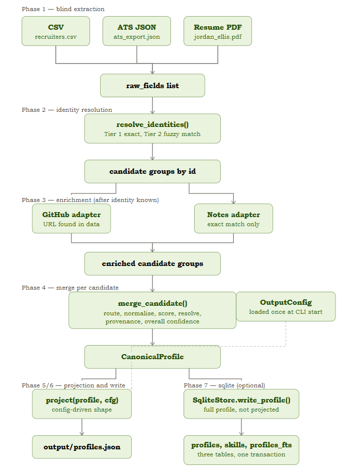

# Eightfold Transformer

A candidate-data transformation pipeline that ingests recruiter CSV exports,
ATS JSON exports, PDF resumes, GitHub profiles, and free-text recruiter notes;
deduplicates and resolves candidate identities across sources; merges
conflicting field values with confidence scoring; and projects the result
into a configurable JSON output and a queryable SQLite database, directly accessible with cli commands.


## Overview

Eightfold Transformer ingests candidate data from four heterogeneous sources — recruiter CSV exports, ATS JSON exports, GitHub profiles, and free-text recruiter notes — and produces a unified, confidence-scored `CanonicalProfile` per candidate.

Key properties:

- **Deterministic.** The same inputs always produce the same output. No random seeds, no non-deterministic clustering.
- **Source-agnostic.** Each adapter translates its source's field names into a common `RawField` envelope. Adding a new source means writing one new adapter — nothing else changes.
- **Confidence-aware.** Every field carries a computed confidence score based on source reliability, extraction method, and cross-source corroboration.
- **Configurable output.** A JSON config file controls which fields appear in the output, how they are named, whether they are re-normalised, and whether confidence/provenance metadata is included.

---

## Architecture

---

## Project structure

```
eightfold-transformer/
├── config/
│   ├── default_schema.json          # Full-field output config (all canonical fields)
│   ├── custom_config_minimal.json   # Minimal output config example
│   └── source_weights.json          # Per-source confidence weights by field category
├── data/
│   ├── skill_synonyms.json          # Canonical skill names and their variants
│   └── iso3166_countries.json       # Country name → ISO 3166-1 alpha-2 lookup
├── sample_inputs/
│   ├── recruiters.csv
│   ├── ats_export.json
│   └── notes/
│       ├── note_001.txt
│       ├── note_002.txt
│       └── note_003.txt
├── src/transformer/
│   ├── cli.py                       # Argument parsing and entry point
│   ├── pipeline.py                  # Phase orchestration
│   ├── raw_field.py                 # RawField Pydantic model
│   ├── schema.py                    # CanonicalProfile and sub-models
│   ├── adapters/
│   │   ├── base.py                  # Abstract SourceAdapter base class
│   │   ├── csv_adapter.py
│   │   ├── ats_adapter.py
│   │   ├── github_adapter.py
│   │   └── notes_adapter.py
│   ├── normalize/
│   │   ├── phone.py                 # E.164 normalisation (phonenumbers)
│   │   ├── date.py                  # YYYY-MM normalisation (dateutil)
│   │   ├── skills.py                # Synonym + fuzzy normalisation (rapidfuzz)
│   │   └── country.py              # ISO 3166 exact-match normalisation
│   ├── resolve/
│   │   └── identity.py             # resolve_identities() + attach_enrichment()
│   ├── merge/
│   │   ├── confidence.py            # Confidence formula and weight loading
│   │   └── merge.py                 # merge_candidate() — field-level merge logic
│   ├── projection/
│   │   ├── config_model.py          # FieldConfig + OutputConfig Pydantic models
│   │   ├── project.py               # profile → output dict projection
│   │   └── schema_gen.py            # JSON Schema generation from OutputConfig
│   ├── store/
│   │   └── sqlite_store.py          # SQLite persistence (WAL, FTS5)
│   └── cache/
│       └── extraction_cache.py      # SHA-256-keyed file cache for GitHub responses
├── tests/
│   ├── conftest.py
│   ├── test_normalize.py
│   ├── test_adapters.py
│   ├── test_identity_resolution.py
│   ├── test_merge_confidence.py
│   ├── test_projection.py
│   └── test_golden_profiles.py
├── output/                          # Default output directory (git-ignored)
├── .cache/                          # GitHub API response cache (auto-created)
├── requirements.txt
└── README.md
```


---

## Requirements

* Python 3.10 or later
* `pip`
* Internet access only if GitHub enrichment is used (everything else runs offline)

---
---

## Installation
clone the repo, install dependencies into a virtual environment, and run the tool with `python -m`

### macOS

```bash
# 1. Clone the repository
git clone <your-repo-url> eightfold-transformer
cd eightfold-transformer

# 2. Create a virtual environment
#    (use python3 here — plain "python" is unreliable on macOS)
python3 -m venv .venv

# 3. Activate the virtual environment
source .venv/bin/activate

# 4. Install dependencies
pip install -r requirements.txt

# 5. Run the pipeline
python -m src.transformer resolve all
```

> Once the virtual environment is activated, `python` correctly points to
> the venv's Python 3 interpreter — every command below works exactly as
> written, with no `python3` prefix needed after this point.

### Windows

```powershell
# 1. Clone the repository
git clone <your-repo-url> eightfold-transformer
cd eightfold-transformer

# 2. Create a virtual environment
python -m venv .venv

# 3. Activate the virtual environment
.venv\Scripts\activate

# 4. Install dependencies
pip install -r requirements.txt

# 5. Run the pipeline
python -m src.transformer resolve all
```

> If PowerShell blocks the activation script with an execution-policy error,
> run this once in an elevated PowerShell window, then retry step 3:
> `Set-ExecutionPolicy -Scope CurrentUser RemoteSigned`

### Dependencies

pydantic>=2.0
phonenumbers
python-dateutil
rapidfuzz
requests
jsonschema
pdfplumber>=0.10.0
click>=8.0

### Important — run from the repository root

On **both** platforms, every command below must be run from inside the
`eightfold-transformer/` folder (the one containing `src/`), with the
virtual environment activated. `python -m src.transformer` resolves its
imports relative to your current working directory, so running it from
anywhere else will fail with a `ModuleNotFoundError`.

---

## Full Command Reference

Every command below is identical on macOS and Windows once the virtual
environment is activated — the only platform differences are the
installation steps above.

### Pipeline commands

```bash
python -m src.transformer resolve all
python -m src.transformer resolve all --dir sample_inputs
python -m src.transformer resolve all --skip-github
python -m src.transformer resolve all --dir sample_inputs --config config/custom_config_minimal.json
python -m src.transformer resolve all --out output/profiles_custom.json
python -m src.transformer resolve all --sqlite output/custom.db
```

| Command | Description |
|---|---|
| `resolve all` | Scans a directory (default: current directory) for all supported file types — CSV, JSON (ATS), PDF (resumes), TXT (notes) — runs the full pipeline, and writes results to `output/candidates.db` and `output/profiles.json`. This is the main command you'll use day-to-day. |
| `resolve all --dir ./sample_inputs` | Same as above but scans a specific directory instead of the current one. Useful when your data files are in a subfolder. |
| `resolve all --skip-github` | Skips the GitHub API enrichment step. Use this when you're offline, rate-limited, or just want a faster run without live data fetching. |
| `resolve all --config config/custom_config_minimal.json` | Uses a custom output schema instead of the default one. Controls which fields appear in the output JSON and how they're named/normalized. |
| `resolve all --out output/profiles_custom.json` | Writes the projected JSON to a custom path instead of the default `output/profiles.json`. |
| `resolve all --sqlite output/custom.db` | Writes the SQLite database to a custom path instead of the default `output/candidates.db`. |

### Explicit-path mode

```bash
python -m src.transformer run --csv-dir sample_inputs --ats sample_inputs/ats_export.json --notes-dir sample_inputs/notes
python -m src.transformer run --csv-dir sample_inputs --ats sample_inputs/ats_export.json --notes-dir sample_inputs/notes --pdf-dir sample_inputs/resumes
python -m src.transformer run --csv-dir sample_inputs --ats sample_inputs/ats_export.json --notes-dir sample_inputs/notes --config config/custom_config_minimal.json --out output/minimal.json
```

| Command | Description |
|---|---|
| `run` | Explicit-path version of `resolve all`. Instead of auto-scanning, you tell it exactly where each type of file lives. More precise, better for scripting and CI pipelines. |
| `run --csv-dir sample_inputs` | Scans a specific directory for `*.csv` files only. |
| `run --ats sample_inputs/ats_export.json` | Points directly at the ATS JSON file instead of auto-detecting it. |
| `run --notes-dir sample_inputs/notes` | Points directly at the notes directory instead of auto-detecting it. |
| `run --pdf-dir sample_inputs/resumes` | Points directly at the PDF resumes directory instead of auto-detecting it. |
| `run --config config/custom_config_minimal.json` | Same as `resolve all --config` — uses a custom output schema. |
| `run --out output/minimal.json` | Custom output JSON path. |
| `run --sqlite output/pipeline.db` | Custom SQLite DB path. |

### Print candidates

```bash
python -m src.transformer print candidates
python -m src.transformer print candidates --sorted
python -m src.transformer print candidates --best 3
python -m src.transformer print candidates --sorted --best 3
python -m src.transformer print candidates --json
python -m src.transformer print candidates --sorted --json
```

| Command | Description |
|---|---|
| `print candidates` | Reads from `output/candidates.db` and prints a table with the five most useful columns: `candidate_id`, `full_name`, `emails`, `headline`, `overall_confidence`. Order is whatever the DB returns (insertion order by default). |
| `print candidates --sorted` | Same table but sorted by `overall_confidence` from highest to lowest. This is the most useful view for ranking candidates. |
| `print candidates --best 3` | Shows only the top N candidates by confidence score. Automatically sorts — no need to add `--sorted`. |
| `print candidates --sorted --best 3` | Sorted and capped. Same as `--best 3` alone but explicit. |
| `print candidates --recent` | Reads from `output/recent.db` (the buffer DB written by the last pipeline run) instead of the main candidates DB. Useful when you want to inspect just the profiles from the most recent batch without seeing older runs mixed in. |
| `print candidates --json` | Outputs raw JSON instead of a table. Useful for piping into other tools or saving to a file. |
| `print candidates --db output/custom.db` | Reads from a specific DB file instead of the default location. Useful when you've been writing to custom paths. |

### Print specific columns

```bash
python -m src.transformer print candidates full_name
python -m src.transformer print candidates full_name headline
python -m src.transformer print candidates full_name emails overall_confidence
python -m src.transformer print candidates full_name headline skills overall_confidence
python -m src.transformer print candidates candidate_id full_name emails phones headline location skills years_experience overall_confidence
python -m src.transformer print candidates full_name overall_confidence --sorted --best 3
python -m src.transformer print candidates full_name headline --json
```

| Command | Description |
|---|---|
| `print candidates full_name` | Shows only the `full_name` column. You can pass any number of column names as positional arguments. |
| `print candidates full_name headline` | Shows only `full_name` and `headline`. |
| `print candidates full_name emails overall_confidence` | Shows name, email, and confidence score — a clean summary view. |
| `print candidates full_name headline skills overall_confidence` | Adds the skills column — shows what each candidate is known for. |
| `print candidates candidate_id full_name emails phones headline location skills years_experience overall_confidence` | Shows every available column — the full view. |
| `print candidates full_name overall_confidence --sorted --best 3` | Combines column selection, sorting, and top-N cap. Shows the top 3 candidates with just name and confidence. |
| `print candidates full_name headline --json` | Custom columns output as JSON instead of a table. |

### Aliases

```bash
python -m src.transformer print candidates-sorted
python -m src.transformer print candidates-sorted --best 3
python -m src.transformer print candidates-sorted full_name headline overall_confidence
python -m src.transformer print candidates-recent
python -m src.transformer print candidates-recent --sorted
```

| Command | Description |
|---|---|
| `print candidates-sorted` | Alias for `print candidates --sorted`. Shorter to type. |
| `print candidates-sorted --best 5` | Top 5 by confidence, sorted. Same as `print candidates --sorted --best 5`. |
| `print candidates-sorted full_name headline overall_confidence` | Sorted table with custom columns. |
| `print candidates-recent` | Alias for `print candidates --recent`. Shows the most recent run's profiles. |
| `print candidates-recent --sorted` | Recent profiles, sorted by confidence. |

### Schema

```bash
python -m src.transformer print schema
```

| Command | Description |
|---|---|
| `print schema` | Lists all valid column names you can pass to `print candidates`. Run this whenever you forget a column name. Also shows the default display width for each column. |

### Global flags (work with any command)

```bash
python -m src.transformer --verbose resolve all
python -m src.transformer -v resolve all
python -m src.transformer --output my_output resolve all
python -m src.transformer -o my_output print candidates --sorted
```

| Flag | Description |
|---|---|
| `--verbose` / `-v` | Enables DEBUG-level logging — shows every internal step including cache hits, field routing decisions, and normalizer calls. Very useful for debugging why a candidate came out wrong. |
| `--output` / `-o` | Changes the output directory for all DB files and JSON exports. Applies to the entire session — put it before the subcommand: `python -m src.transformer -o my_output resolve all`. |

### Help

```bash
python -m src.transformer --help
python -m src.transformer resolve --help
python -m src.transformer resolve all --help
python -m src.transformer print --help
python -m src.transformer print candidates --help
python -m src.transformer run --help
```

`--help` works on every command and subcommand and shows available flags
and examples.

---

## Configuration

### Output config schema

The output config controls exactly which fields appear in the result, how they are named, and whether confidence/provenance metadata is included.

```json
{
  "include_confidence": true,
  "include_provenance": true,
  "on_missing": "null",
  "fields": [
    {
      "path": "candidate_id",
      "type": "string",
      "required": true
    },
    {
      "path": "full_name",
      "type": "string"
    },
    {
      "path": "emails",
      "type": "array"
    },
    {
      "path": "phones",
      "type": "array"
    },
    {
      "path": "location.city",
      "type": "string"
    },
    {
      "path": "location.region",
      "type": "string"
    },
    {
      "path": "location.country",
      "type": "string"
    },
    {
      "path": "links.linkedin",
      "type": "string"
    },
    {
      "path": "links.github",
      "type": "string"
    },
    {
      "path": "links.portfolio",
      "type": "string"
    },
    {
      "path": "links.other",
      "type": "array"
    },
    {
      "path": "headline",
      "type": "string"
    },
    {
      "path": "years_experience",
      "type": "number"
    },
    {
      "path": "skills",
      "type": "array"
    },
    {
      "path": "experience",
      "type": "array"
    },
    {
      "path": "education",
      "type": "array"
    },
    {
      "path": "overall_confidence",
      "type": "number"
    }
  ]
}

```


### Source weights

`config/source_weights.json` controls how much each source is trusted per field category:

```json
{
  "csv": {"identity": 0.9, "employment": 0.85, "skills": 0.3},
  "ats_json": {"identity": 0.95, "employment": 0.9, "skills": 0.4},
  "github": {"identity": 0.4, "employment": 0.1, "skills": 0.85},
  "notes": {"identity": 0.3, "employment": 0.4, "skills": 0.5},
  "resume_pdf" : {"identity": 0.75, "employment": 0.8, "skills": 0.7}
}

```

Field categories: `identity` (name, email, phone, location, links), `employment` (headline, experience, education), `skills`.

---

## Pipeline phases

### Phase 1 — Extraction

`CsvAdapter` and `AtsJsonAdapter` read their respective input files and emit a flat `list[RawField]`. Each `RawField` carries:

- `field_name` — canonical logical name (e.g. `"emails"`, `"location.city"`)
- `value` — the raw extracted value
- `source` — adapter identifier (`"csv"`, `"ats_json"`, etc.)
- `method` — extraction technique (`"direct_copy"`, `"field_remap"`, etc.)
- `raw_text` — original unprocessed text for audit
- `record_index` — row/record position within the source (set by the adapter itself)

### Phase 2 — Identity resolution

`resolve_identities()` groups the flat field list into per-candidate buckets using two-tier deterministic blocking (see [Identity resolution](#identity-resolution) below). Each `RawField`'s `candidate_id` attribute is set in-place.

### Phase 3 — Enrichment

`attach_enrichment()` scans each candidate's existing fields for a `links.github` URL, calls `GithubAdapter.extract()` for each, and appends the returned `RawField`s to that candidate. It then reads every `*.txt` file in `--notes-dir`, runs `NotesAdapter.extract()`, and matches the note to a candidate via exact email or phone. Notes are attached conservatively — fuzzy name matching is deliberately excluded to avoid contaminating the wrong candidate's profile.

### Phase 4 — Merge

`merge_candidate()` runs for each candidate independently. It routes every `RawField` to its canonical path, normalises the value, computes a confidence score, and resolves conflicts. The result is a fully populated `CanonicalProfile`.

### Phase 5 — Projection

`project()` walks the `CanonicalProfile` dictionary, resolves each `FieldConfig.from_` path, optionally re-normalises, applies the `on_missing` policy, and wraps in confidence/provenance envelopes. The output dict is validated against a JSON Schema generated from the same `OutputConfig`.

### Phase 6 — JSON output

The list of projected dicts is written to `--out` as a UTF-8 JSON array.

### Phase 7 — SQLite persistence (optional)

When `--sqlite` is supplied, each `CanonicalProfile` is upserted into a SQLite database with WAL journal mode. Three tables are maintained: `profiles` (scalar columns + full JSON blob), `skills` (indexed for O(log n) skill search), and `profiles_fts` (FTS5 virtual table for full-text search).

---

## Data sources and adapters

All adapters inherit from `SourceAdapter` (defined in `adapters/base.py`) and must uphold one contract: `extract()` **never raises**. On any failure the method logs a `WARNING` and returns `[]`.

### CSV adapter

Reads recruiter CSV exports with `csv.DictReader`. Column names are mapped to canonical field names via a broad alias table (e.g. `"candidate name"`, `"applicant_name"`, and `"full_name"` all map to `full_name`). Blank cells are skipped; the whole row is never skipped due to a single missing field.

### ATS JSON adapter

Reads a JSON file whose top-level value is a list of ATS candidate records. Translates non-canonical ATS field names (e.g. `cand_full_nm`, `job_ttl`, `gh_url`) to canonical names. Supports an extensive alias table covering many common ATS and CRM field name conventions.

### GitHub adapter

Parses the GitHub username from a profile URL, then makes two calls to the GitHub REST API v3:

- `GET /users/{username}` — extracts `full_name` (from `name`) and `headline` (from `bio`)
- `GET /users/{username}/repos?per_page=100` — extracts one `skills` `RawField` per distinct programming language

Responses are cached in `.cache/` before each HTTP call and stored after (see [Caching](#caching)).

### Notes adapter

Reads a plain-text `.txt` file and extracts:

1. **Email** — first match of a standard email regex, `method="regex_extract"`
2. **Phone** — first phone-like string with ≥7 digits, `method="regex_extract"`
3. **Skills** — whole-word case-insensitive keyword match against `data/skill_synonyms.json`, `method="keyword_match"`. One `RawField` per distinct canonical skill found.

All `RawField`s carry `raw_text` set to the full note content for a complete audit trail.

### Resume Adaptor
Reads resumes available in resume directory and extracts data from them.
---

## Identity resolution

Identity resolution uses **deterministic two-tier blocking** — the standard entity resolution approach (Fellegi-Sunter, 1969) at typical recruitment dataset scale. Clustering algorithms (K-means, DBSCAN) are intentionally not used because:

- K (number of candidates) is unknown in advance
- Matching signals are incommensurable (exact email vs. fuzzy name) and cannot be collapsed into a single distance vector
- Determinism is a hard requirement for auditability

**Tier 1 — exact match (O(1) via hash index)**

A record is merged into an existing candidate if it shares a normalised email address or an E.164-normalised phone number with any field already attributed to that candidate.

**Tier 2 — fuzzy name + company (fallback only)**

If no Tier-1 key matched, the incoming record is compared against all existing candidates using:
- `rapidfuzz.fuzz.token_sort_ratio` on `full_name` ≥ 88
- `rapidfuzz.fuzz.token_sort_ratio` on `current_company` ≥ 75

Both conditions must be met. A missing company on either side does **not** count as a match — name similarity alone is insufficient.

Records that match neither tier become new candidates with a UUID-derived ID.

---

## Merge and confidence scoring

`merge_candidate()` processes each canonical field through a common pipeline:

1. **Route** — map each `RawField.field_name` to its canonical dotted path. `current_title` is a special case: it routes to both `headline` and `experience.title` simultaneously (multi-target routing).

2. **Normalise** — apply the field-appropriate normaliser (phone, date, skill, country, or default string strip).

3. **Score** — compute confidence for each value assertion:

   ```
   confidence = min(1.0,
     source_weight(source, field_category)
     × method_certainty(method)
     × (1.0 + 0.15 × (corroborating_source_count − 1))
   )
   ```

   Method certainty table:

   | Method | Certainty |
   |---|---|
   | `direct_copy` | 1.00 |
   | `field_remap` | 0.95 |
   | `api_fetch` | 0.80 |
   | `regex_extract` | 0.60 |
   | `keyword_match` | 0.50 |
   | `fuzzy_match` | 0.50 |

4. **Resolve** — for scalar fields, the highest-confidence value wins. Conflicts (two or more distinct values) are logged as `WARNING` with full source attribution — never silently dropped. For list fields (`emails`, `phones`, `skills`), the union of all distinct normalised values is taken.

5. **Provenance** — a `ProvenanceEntry` is appended for every populated field, carrying that field's own confidence score (not a single profile-wide number).

6. **Overall confidence** — a weighted blend:
   - 50% mean of per-field confidences
   - 30% corroboration score (fraction of scalar fields confirmed by ≥2 distinct sources)
   - 20% source coverage score (fraction of the 4 known sources that contributed at least one field)

---

## Normalisation

All normalisers are pure functions with no I/O per call. Data files are loaded once at module import time.

### `normalize_phone(raw, country_hint=None)`

Uses the `phonenumbers` library. Tries parsing with the provided country hint, then falls back to `"US"` as a last resort. Returns an E.164 string (e.g. `"+14155550192"`) or `None` if the input cannot be parsed.

### `normalize_skill(raw)`

Lookup order:
1. Exact lowercase match against `data/skill_synonyms.json`
2. `rapidfuzz.fuzz.ratio` fuzzy match against all keys (threshold 85)
3. Return the original input capitalised as a best-effort fallback (unknown skills are never dropped)

### `normalize_country(raw)`

Exact lowercase match against `data/iso3166_countries.json`. Returns ISO 3166-1 alpha-2 code or `None`. Deliberately strict — no fuzzy matching — because a wrong country code would corrupt downstream phone normalisation.

### `normalize_date(raw)`

Uses `dateutil.parser.parse` with `fuzzy=True`. Returns a `"YYYY-MM"` string, the literal string `"present"` for open-ended ranges, or `None` if the input cannot be parsed.

---

## Projection

**Missing-value policy** (`on_missing`):

| Policy | Behaviour |
|---|---|
| `"null"` | Key is kept in output; value is `null` |
| `"omit"` | Key is dropped from output entirely |
| `"error"` | `MissingRequiredFieldError` is raised |

Fields marked `required: true` always raise on missing, regardless of `on_missing`.

After projection, the output dict is validated against a JSON Schema generated from the same `OutputConfig` by `generate_json_schema()`. This makes schema drift structurally impossible.

---

## SQLite persistence

When `--sqlite` is provided, `SqliteStore` maintains three tables:

```sql
profiles          -- one row per candidate; scalar columns + full_profile_json blob
skills            -- one row per (candidate, skill); indexed for fast skill search
profiles_fts      -- FTS5 virtual table on full_name, headline, company, skills_text
```

Key design choices:

- **WAL journal mode** — allows concurrent readers while a write is in progress.
- **Single transaction per profile** — profiles, skills, and FTS rows are committed together; the database is never left in a partially-written state.
- **Idempotent** — re-running the pipeline for the same candidates uses `INSERT OR REPLACE`; the database converges to the latest state.


---

## Caching

`ExtractionCache` is a SHA-256-keyed, JSON-backed file cache stored in `.cache/`. It is used exclusively by `GithubAdapter` to avoid redundant API calls across pipeline runs.

```python
from src.transformer.cache.extraction_cache import ExtractionCache

cache = ExtractionCache(".cache")
data = cache.get("https://api.github.com/users/octocat")  # None on miss
if data is None:
    data = requests.get(...).json()
    cache.set("https://api.github.com/users/octocat", data)
```

`get()` never raises — it returns `None` on any miss, corrupted file, or permission error. `set()` logs a warning on failure and swallows the exception, preserving the adapter's never-raise contract.

To clear the cache:

```bash
rm -rf .cache/
```

---

## Output formats

### Default schema output (`config/default_schema.json`)

```json
[
  {
    "candidate_id": "a3f8e1b2c901",
    "full_name": { "value": "Jordan Ellis", "confidence": 0.9500 },
    "emails":    { "value": ["jordan.ellis@gmail.com"], "confidence": 0.9025 },
    "phones":    { "value": ["+14155550192"], "confidence": 0.9025 },
    "location": {
      "city":    { "value": "San Francisco", "confidence": 0.9025 },
      "country": { "value": "US", "confidence": 0.9025 }
    },
    "skills":    { "value": ["Python", "React", "Kubernetes", "AWS"], "confidence": 0.62 },
    "overall_confidence": { "value": 0.7812, "confidence": 0.7812 }
  }
]
```

### Minimal schema output (`config/custom_config_minimal.json`)

```json
[
  {
    "full_name":     { "value": "Jordan Ellis",          "confidence": 1.0 },
    "primary_email": { "value": "jordan.ellis@gmail.com", "confidence": 0.9025 },
    "phone":         { "value": "+14155550192",           "confidence": 0.9025 },
    "skills":        { "value": ["Python", "React", "AWS"], "confidence": 0.25 }
  }
]
```

---

## Running tests

```bash
pytest tests/ -v

```

`tests/conftest.py` adds the project root to `sys.path` so tests can import `src.transformer` without installing the package.

---

## Design decisions

**Why not use a clustering algorithm for identity resolution?**

K-means and DBSCAN both require either a known K or a distance metric that works uniformly across all feature types. Email addresses are exact-match signals; phone numbers require E.164 normalisation before comparison; names require fuzzy string similarity. These signals are incommensurable — no single numeric distance captures all of them faithfully. Deterministic blocking by exact key is the standard entity-resolution approach at this scale (Fellegi-Sunter, 1969; Christen, *Data Matching*, 2012) and is fully explainable to recruiters and auditors.

**Why is country normalisation exact-match only?**

A wrong country code propagates silently into `normalize_phone()`, where it would cause the phone parser to interpret numbers under the wrong country's dialling rules. A `None` country is recoverable; `"AU"` when the candidate is in `"AT"` (Austria) is not. Strictness here is a deliberate trade-off: we prefer no country over a wrong one.

**Why does `current_title` route to two canonical paths?**

Both `headline` (the candidate's professional tagline) and `experience.title` (the title within a work-history entry) legitimately receive the same value from ATS and CSV sources. A flat `str → str` route map cannot express "one input, two outputs", so multi-target routing is handled via a separate `_MULTI_FIELD_ROUTE` dict checked before the primary `_FIELD_ROUTE`.

**Why is the JSON Schema generated from the OutputConfig rather than written by hand?**

Keeping a separate hand-maintained schema in sync with a config file that changes frequently is a maintenance liability. Generating the schema from the same config that drives projection makes schema drift structurally impossible: if the config says a field exists, the schema will validate for it; if the config removes it, the schema won't accept it.

**Why WAL mode for SQLite?**

Write-Ahead Logging allows concurrent reads while a write is in progress. This is important when a query tool (e.g. a reporting script or `sqlite3` CLI) is open against the database while the pipeline is running. Without WAL, a write transaction would lock the entire database and block all readers.


[def]: image-1.png